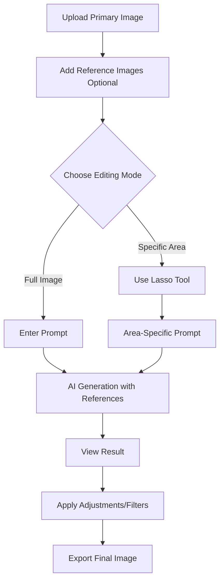

# 🎨 TAP[IMAGINE] Complete Features Guide

## Table of Contents
1. [Lasso Selection Tool](#lasso-selection-tool)
2. [Reference Image Upload](#reference-image-upload)
3. [How Features Work Together](#how-features-work-together)
4. [Complete Workflow Examples](#complete-workflow-examples)

---

## 🎯 Lasso Selection Tool

### What Is It?
A precision tool that lets you select specific areas of your image and apply AI transformations **only to that region** while keeping the rest unchanged.

### Access
Click the **Scissors icon (✂️)** in the top header of the editor.

### Quick Start
1. Upload an image
2. Click scissors icon
3. Click points around the area you want to edit
4. Click "Complete Selection"
5. Enter what you want to change (e.g., "make this shirt red")
6. Click "Apply Changes"

### Key Features
- ✅ Point-and-click selection
- ✅ Visual feedback with yellow highlighting
- ✅ Minimum 3 points required
- ✅ Area-specific AI editing
- ✅ Quick suggestion prompts
- ✅ Real-time point counter

### Example Use Cases
```
🎨 Fashion: "Make this t-shirt red"
🌅 Sky: "Add a bird flying in this area"
💇 Hair: "Change hair color to blonde"
🌆 Background: "Make this background sunset"
👓 Accessories: "Add sunglasses to this person"
```

---

## 🖼️ Reference Image Upload

### What Is It?
Upload additional reference images that the AI will use as style guides or to extract specific elements (people, objects, styles) when generating your edited image.

### Access
Available in the **Prompt tab** under "Reference Images (Optional)"

### Quick Start
1. Go to "Prompt" tab
2. Click **"Add Image"** button
3. Select one or more reference images
4. Images appear in preview grid
5. Enter your prompt mentioning the reference
6. Click "Generate Image"

### Key Features
- ✅ Multiple image upload support
- ✅ Preview grid with thumbnails
- ✅ Individual remove buttons (hover over image)
- ✅ Images sent to Gemini alongside main image
- ✅ Works with both normal and area-specific editing

### Example Use Cases
```
👤 Person Addition: Upload friend's photo → "Add this person standing next to me"
🎨 Style Transfer: Upload painting → "Apply the art style from the reference image"
🏞️ Background: Upload scenery → "Replace my background with this landscape"
👕 Object: Upload item → "Make me wear this jacket from the reference"
🌟 Multi-Reference: Upload multiple → "Combine elements from all reference images"
```

---

## 🔗 How Features Work Together

### Workflow Integration



### Combined Power

1. **Area Selection + Reference Images**
   - Select a specific area (e.g., clothing)
   - Upload reference image (e.g., desired pattern)
   - Prompt: "Apply the pattern from reference to this shirt"
   - Result: Only the selected shirt area gets the reference pattern

2. **Multi-Reference + Area Editing**
   - Upload multiple reference images (different styles, objects)
   - Select area with lasso tool
   - Combine elements: "Add the person from reference 1 and the background from reference 2 in this selected area"

---

## 📚 Complete Workflow Examples

### Example 1: Change T-Shirt to Match Reference
**Goal**: Change t-shirt color and pattern to match a reference image

**Steps**:
1. Upload your photo (primary image)
2. Go to "Prompt" tab
3. Click "Add Image" and upload reference t-shirt image
4. Click scissors icon (✂️) to open lasso tool
5. Draw selection around your t-shirt
6. Click "Complete Selection"
7. Enter prompt: "Make this t-shirt match the design and color from the reference image"
8. Click "Apply Changes"
9. AI modifies only the t-shirt area using reference style

**Result**: Your t-shirt now matches the reference, rest of image unchanged

---

### Example 2: Add Person from Reference to Background
**Goal**: Add a friend from another photo into the background of your image

**Steps**:
1. Upload your main photo
2. Go to "Prompt" tab
3. Click "Add Image" and upload friend's photo
4. Click scissors icon (✂️)
5. Draw selection in background where you want friend to appear
6. Click "Complete Selection"
7. Enter prompt: "Add the person from the reference image standing in this area"
8. Click "Apply Changes"
9. AI places friend in selected background area

**Result**: Friend appears in background, seamlessly integrated

---

### Example 3: Style Transfer to Specific Area
**Goal**: Apply artistic style from reference to only the background

**Steps**:
1. Upload your portrait photo
2. Go to "Prompt" tab
3. Click "Add Image" and upload artistic painting reference
4. Click scissors icon (✂️)
5. Draw selection around the background (avoiding subject)
6. Click "Complete Selection"
7. Enter prompt: "Apply the artistic style from the reference image to this background area"
8. Click "Apply Changes"

**Result**: Background becomes artistic, subject stays photographic

---

### Example 4: Multi-Reference Object Addition
**Goal**: Add multiple objects from different references to sky

**Steps**:
1. Upload landscape photo
2. Go to "Prompt" tab
3. Click "Add Image" multiple times to upload:
   - Reference 1: Bird photo
   - Reference 2: Cloud formation
   - Reference 3: Sunset colors
4. Click scissors icon (✂️)
5. Draw selection around sky area
6. Click "Complete Selection"
7. Enter prompt: "Add the bird from reference 1, cloud formation from reference 2, and apply sunset colors from reference 3 to this sky"
8. Click "Apply Changes"

**Result**: Sky now has bird, clouds, and sunset colors, ground unchanged

---

### Example 5: Full Image with Multiple References (No Lasso)
**Goal**: Transform entire image using multiple style references

**Steps**:
1. Upload your photo
2. Go to "Prompt" tab
3. Add multiple reference images (e.g., anime style, color palette, lighting example)
4. DO NOT use lasso tool (want full image edit)
5. Enter prompt: "Transform this image to anime style using the art style from reference 1, color palette from reference 2, and lighting from reference 3"
6. Click "Generate Image"

**Result**: Entire image transformed with combined reference styles

---

## 🎨 Best Practices

### For Lasso Selection:
1. **Precise Selection**: Draw tight around your target area
2. **Clear Prompts**: Be specific about changes
3. **Good**: "Make this t-shirt bright red"
4. **Bad**: "Change this"

### For Reference Images:
1. **Quality Matters**: Use high-quality, clear reference images
2. **Relevant References**: Upload images that clearly show what you want
3. **Name Elements**: Mention "reference image" or "reference 1, 2, 3" in prompts
4. **Good**: "Add this person from the reference to my left side"
5. **Bad**: "Add someone"

### For Combined Usage:
1. **Order Matters**: Upload references before using lasso tool
2. **Specific Instructions**: Clearly specify which reference for what purpose
3. **Iteration**: Don't expect perfection first try, refine prompts
4. **Test**: Try area-specific first, then full image if needed

---

## 🔧 Technical Notes

### Lasso Selection
- Creates bounding box from selected points
- Sends coordinates in prompt to Gemini
- AI interprets area from coordinates
- No actual mask sent (Gemini limitation)

### Reference Images
- Sent as additional image inputs to Gemini API
- Supports multiple references (up to API limit)
- Base64 encoded with main image
- AI analyzes all images together

### Processing Flow
```
User Action → Selection/Reference Setup → Prompt Enhancement → 
Gemini API Call → Image Generation → Display Result → 
Adjustments/Filters → Export
```

---

## ❓ Troubleshooting

### Lasso Tool Issues

**Problem**: Can't complete selection
**Solution**: Need at least 3 points

**Problem**: Wrong area edited
**Solution**: Be more specific in prompt, improve selection precision

**Problem**: Tool won't open
**Solution**: Upload an image first

### Reference Image Issues

**Problem**: Can't see uploaded references
**Solution**: Check preview grid in Prompt tab, should show thumbnails

**Problem**: AI not using references
**Solution**: Explicitly mention "reference image" in your prompt

**Problem**: Too many references
**Solution**: Use 1-3 for best results, more can confuse AI

### Combined Issues

**Problem**: Area edit ignoring reference
**Solution**: Ensure reference uploaded BEFORE lasso selection, mention it in area prompt

---

## 🚀 Pro Tips

1. **Chain Edits**: Use generated image as base for next edit (automatic chaining)
2. **Undo/Redo**: Use header buttons if you don't like a result
3. **Save Iterations**: Export each version before trying next edit
4. **Experiment**: Try different prompts for same selection
5. **Reference Library**: Keep folder of useful reference images
6. **Combine Tools**: Use filters and adjustments AFTER AI editing
7. **Templates**: Check Templates tab for pre-made prompts

---

## 📖 Related Documentation

- [`LASSO_SELECTION_FEATURE.md`](./LASSO_SELECTION_FEATURE.md) - Detailed lasso tool guide
- [`NEW_TEMPLATES_AND_FEATURES.md`](./NEW_TEMPLATES_AND_FEATURES.md) - Template library + reference images
- [`IMPLEMENTATION_SUMMARY.md`](./IMPLEMENTATION_SUMMARY.md) - Quick technical reference

---

## 🎯 Quick Reference Card

| Feature | Access | Use Case |
|---------|--------|----------|
| **Lasso Selection** | Scissors icon (✂️) | Edit specific area only |
| **Reference Upload** | Prompt tab → Add Image | Style guide, add people/objects |
| **Combined** | Both together | Area-specific with reference style |
| **Undo/Redo** | Header buttons | Revert changes |
| **Export** | Export button | Save final image |

---

**Need Help?** Check individual feature docs or experiment with the examples above!
