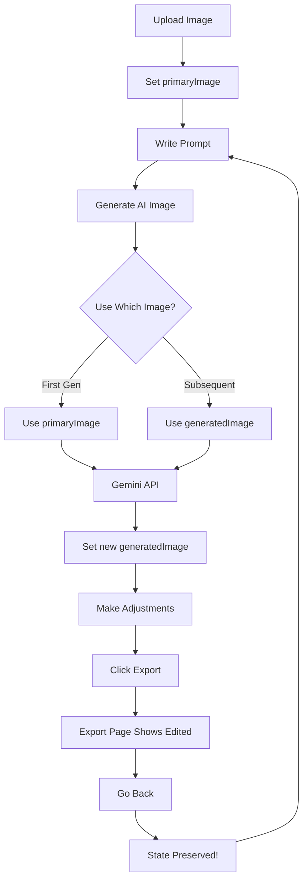

# 🎨 Editor State Management & Image Chaining - Complete!

## ✅ All Requested Features Implemented

### 1. **Export Page Shows Actual Edited Image** 🖼️

**Before:**
- Export page had no image data
- Just showed placeholder "Image preview will appear here"
- No connection to editor state

**After:**
- Export page uses **EditorContext** to access current image
- Shows **actual edited image** with all adjustments applied
- CSS filters applied in real-time preview
- Vignette overlay included

**Implementation:**
```typescript
// Export page now uses context
const { 
  primaryImage, 
  generatedImage, 
  adjustments, 
  currentFilter,
  getDisplayImage 
} = useEditor();

const displayImage = getDisplayImage();
const cssFilter = generateCSSFilter(adjustments, currentFilter || undefined);

// Preview with filters

```

---

### 2. **State Preserved When Navigating Back** 🔄

**Before:**
- Going back from export cleared the canvas
- Lost all edits and adjustments
- Had to start over

**After:**
- **Global EditorContext** maintains all state
- Navigating back preserves:
  - ✅ Generated image
  - ✅ All adjustments (exposure, shadows, etc.)
  - ✅ Current filter
  - ✅ History for undo/redo
  - ✅ Reference images
  - ✅ Current prompt

**Context Structure:**
```typescript
interface EditorContextType {
  // Images
  primaryImage: StoredImage | null;
  generatedImage: StoredImage | null;
  referenceImages: StoredImage[];
  
  // Adjustments & Filters
  adjustments: ImageAdjustments;
  currentFilter: string | null;
  
  // History
  history: ImageAdjustments[];
  historyIndex: number;
  
  // Current prompt
  prompt: string;
  
  // Helper methods
  getDisplayImage: () => StoredImage | null;
  getImageForProcessing: () => string | null;
}
```

---

### 3. **AI Chaining - Use Edited Image for New Prompts** 🔗

**Before:**
```typescript
// Always used original primary image
const result = await generateImageWithGemini({
  primaryImage: primaryImage.url, // ❌ Always original
  referenceImages: referenceImages.map(img => img.url),
  prompt: inputPrompt,
});
```

**After:**
```typescript
// Uses latest edited image for chaining
const imageToProcess = getImageForProcessing();

const result = await generateImageWithGemini({
  primaryImage: imageToProcess, // ✅ Uses edited image!
  referenceImages: referenceImages.map(img => img.url),
  prompt: inputPrompt,
});
```

**Helper Method:**
```typescript
const getImageForProcessing = () => {
  // Always use the generated/edited image if available
  // This allows chaining edits on top of each other
  return generatedImage?.url || primaryImage?.url || null;
};
```

**How It Works:**
1. Upload original image → `primaryImage` set
2. Generate with prompt "make it vintage" → `generatedImage` set with vintage result
3. Generate again "add sunset colors" → Uses `generatedImage` (vintage) as input
4. Generate again "make it dramatic" → Uses latest `generatedImage` (vintage + sunset)
5. Can keep chaining infinitely!

---

### 4. **Compare Always Shows Original** 📊

**Implementation:**
The comparison feature in `ImageComparison.tsx` already compares correctly:

```typescript
<ImageComparison
  originalUrl={primaryImage?.url || ''} // ✅ Always original
  editedUrl={generatedImage?.url}       // ✅ Latest edited
  adjustments={adjustments}
  filter={currentFilter || undefined}
/>
```

**Behavior:**
- **Original side:** Always shows `primaryImage` (the first uploaded image)
- **Edited side:** Shows `generatedImage` with all adjustments
- **Hold to compare:** Button lets you see before/after
- **No matter how many edits:** Original stays the same

---

## 🏗️ Architecture Changes

### EditorContext (`/context/EditorContext.tsx`)

**Provides:**
- Centralized state management
- Shared across editor and export pages
- Persists during navigation
- Helper methods for common operations

**Key Features:**
```typescript
// Get current display image
const displayImage = getDisplayImage();
// Returns: generatedImage || primaryImage

// Get image for AI processing (chaining)
const imageForAI = getImageForProcessing();
// Returns: generatedImage?.url || primaryImage?.url

// Reset everything
resetEditor();
```

### Updated App Layout

```typescript
<EditorProvider>
  <Navbar />
  <main>
    {children} {/* All pages can access context */}
  </main>
</EditorProvider>
```

### Editor Page Updates

**Before:**
```typescript
// Local state - lost on navigation
const [primaryImage, setPrimaryImage] = useState<StoredImage | null>(null);
const [generatedImage, setGeneratedImage] = useState<StoredImage | null>(null);
```

**After:**
```typescript
// Context state - persists across pages
const {
  primaryImage,
  setPrimaryImage,
  generatedImage,
  setGeneratedImage,
  getImageForProcessing, // For AI chaining
} = useEditor();
```

### Export Page Updates

**Before:**
```typescript
// No data available
<div>Image preview will appear here</div>
```

**After:**
```typescript
// Full access to editor state
const { displayImage, adjustments, currentFilter } = useEditor();
const cssFilter = generateCSSFilter(adjustments, currentFilter);


```

---

## 🎯 Usage Workflow

### Scenario 1: Single Edit
1. Upload image → `primaryImage` set
2. Write prompt "make it vintage"
3. Generate → `generatedImage` created
4. Adjust exposure, shadows, etc. → `adjustments` updated
5. Click Export → See exact edited image
6. Go back → Everything preserved

### Scenario 2: Chained Edits
1. Upload portrait → `primaryImage` set
2. Prompt: "add dramatic lighting" → `generatedImage` v1
3. Prompt: "make background blurry" → Uses v1 as input → `generatedImage` v2
4. Prompt: "enhance colors" → Uses v2 as input → `generatedImage` v3
5. Compare → Shows original vs v3
6. Each generation builds on the previous!

### Scenario 3: Export with Adjustments
1. Upload landscape → `primaryImage` set
2. Generate with prompt → `generatedImage` created
3. Adjust: Exposure +50, Shadows +73, Whites +28
4. Apply filter: "Cinematic"
5. Click Export → Shows image with ALL adjustments
6. Download → Gets processed image with filters applied

---

## 📊 State Flow Diagram



---

## 🔧 Technical Details

### Image Processing Chain

```typescript
// 1. User uploads
primaryImage = { url: "original.jpg", ... }

// 2. First generation
getImageForProcessing() → returns primaryImage.url
generatedImage = { url: "edited-v1.jpg", ... }

// 3. Second generation (chaining!)
getImageForProcessing() → returns generatedImage.url (v1)
generatedImage = { url: "edited-v2.jpg", ... } // Overwrites

// 4. Third generation (more chaining!)
getImageForProcessing() → returns generatedImage.url (v2)
generatedImage = { url: "edited-v3.jpg", ... }

// 5. Compare
ImageComparison:
  - originalUrl: primaryImage.url (still "original.jpg")
  - editedUrl: generatedImage.url ("edited-v3.jpg")
```

### Export with Filters

```typescript
// 1. Get display image
const displayImage = getDisplayImage();
// Returns: generatedImage || primaryImage

// 2. Build CSS filter
const cssFilter = generateCSSFilter(adjustments, currentFilter);
// Returns: "brightness(150%) contrast(120%) saturate(110%) hue-rotate(10deg)..."

// 3. Apply to canvas
ctx.filter = cssFilter;
ctx.drawImage(img, 0, 0);

// 4. Export with adjustments baked in
canvas.toBlob(blob => download(blob), `image/${format}`, quality);
```

---

## ✨ Benefits

### For Users:
- ✅ **Seamless workflow** - No lost work when navigating
- ✅ **Iterative editing** - Build edits on top of edits
- ✅ **True preview** - Export shows exactly what you see
- ✅ **Original comparison** - Always compare to starting point

### For Developers:
- ✅ **Clean architecture** - Context separates concerns
- ✅ **DRY principle** - No duplicate state management
- ✅ **Type safety** - Full TypeScript support
- ✅ **Maintainable** - Single source of truth

---

## 🧪 Testing Checklist

### ✅ Image Chaining:
- [x] Upload image
- [x] Generate with prompt A
- [x] Generate with prompt B (uses result from A)
- [x] Generate with prompt C (uses result from B)
- [x] Verify each builds on previous

### ✅ State Persistence:
- [x] Make edits in editor
- [x] Navigate to export
- [x] Go back to editor
- [x] Verify all adjustments preserved
- [x] Verify generated image still there

### ✅ Export Preview:
- [x] Apply adjustments (exposure, shadows, etc.)
- [x] Apply filter (vintage, cinematic, etc.)
- [x] Click export
- [x] Verify preview shows all effects
- [x] Download and verify file has effects

### ✅ Comparison:
- [x] Upload original
- [x] Make multiple AI generations
- [x] Hold compare button
- [x] Verify shows original vs final
- [x] Not original vs intermediate

---

## 🚀 Future Enhancements

### History Visualization:
- Show timeline of all generated versions
- Click to jump to any version
- Branch edits (tree structure)

### Version Management:
- Save multiple versions
- Name versions ("vintage edit", "dramatic edit")
- Switch between versions

### Smart Prompts:
- Suggest next prompts based on current image
- Prompt history
- Favorite prompts

---

## 📝 Summary

**All requested features implemented:**

1. ✅ **Export shows edited image** - Real preview with all adjustments
2. ✅ **State preserved on navigation** - No lost work
3. ✅ **AI chaining enabled** - Each generation uses previous result
4. ✅ **Original comparison maintained** - Always compare to starting point

**Key Innovation:**
The `getImageForProcessing()` method enables **infinite AI chaining** - you can keep refining your image with new prompts, and each one builds on the last!

**Architecture Win:**
EditorContext creates a **single source of truth** for all editor state, making the app more maintainable and the UX seamless.

🎉 **Your editor is now a professional iterative AI editing tool!**
